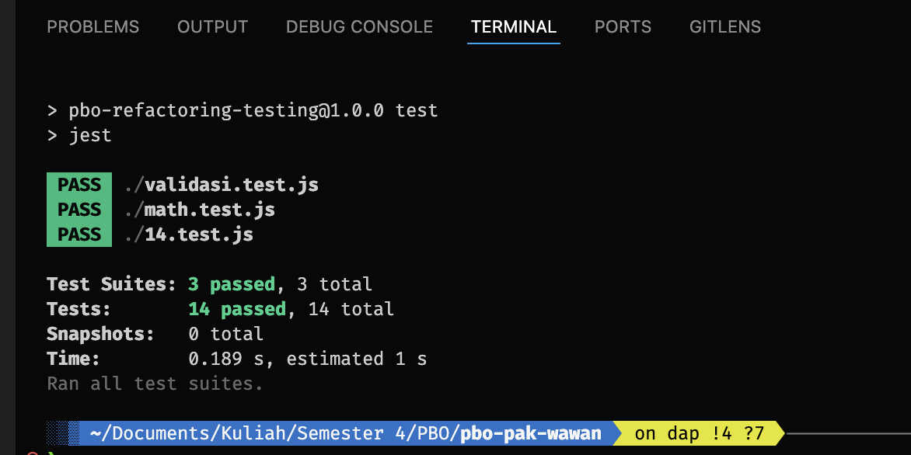

# 📚 Review Materi PBO Pak Wawan - Semester 4

Repository ini berisi review dan implementasi materi Pemrograman Berorientasi Objek (PBO) yang telah dipelajari selama semester 4. Materi fokus pada **Refactoring dan Pengujian Perangkat Lunak** menggunakan JavaScript dan Jest.

## 🎯 Tujuan Pembelajaran

Repository ini dibuat untuk:
- 📖 **Review materi** yang telah dipelajari
- 🔧 **Praktik implementasi** konsep refactoring
- 🧪 **Latihan pengujian unit** dengan Jest
- 📝 **Dokumentasi** pembelajaran untuk referensi masa depan

## 📁 Struktur Project

### 📄 **File Utama:**
- `14.template.js` - Contoh refactoring fungsi hitung total harga
- `math.template.js` - Fungsi matematika sederhana untuk pengujian
- `email.template.js` - Fungsi validasi email
- `demo.js` - File demonstrasi penggunaan semua fungsi

### 🧪 **File Pengujian:**
- `14.test.js` - Pengujian untuk fungsi hitung total harga
- `math.test.js` - Pengujian untuk fungsi matematika
- `validasi.test.js` - Pengujian untuk validasi email

### ⚙️ **Konfigurasi:**
- `package.json` - Konfigurasi Node.js dan Jest
- `.gitignore` - File untuk mengabaikan file yang tidak perlu di-commit
- `takeaways.txt` - Catatan materi pembelajaran

### 📚 **Review Materi (Folder `review-materi/`)**

#### 🏛️ **PBO-1: Konsep Dasar OOP**
Folder: `review-materi/pbo-1/`
- `abstraction.html` - Implementasi konsep abstraksi dengan kelas abstrak
- `encapsulation.html` - Penerapan enkapsulasi dan private properties
- `inheritance.html` - Contoh pewarisan kelas (inheritance)
- `polimorphism.html` - Demonstrasi polimorfisme dengan method overriding

#### 📝 **Tugas 3: Perbandingan ES6 vs Pre-ES6**
Folder: `review-materi/tugas-3/`
- `before-es6.js` - OOP menggunakan function constructor dan prototype
- `after-es6.js` - OOP menggunakan class syntax ES6
- `PBO tugas 3.docx` - Dokumentasi tugas dan penjelasan

#### 🔧 **Tugas 4: Implementasi OOP Lanjutan**
Folder: `review-materi/tugas-4/`
- `index.js` - Implementasi konsep OOP yang lebih kompleks
- `tugas 4.docx` - Dokumentasi dan analisis tugas

#### 🏗️ **Tugas 5: Inheritance & Polymorphism**
Folder: `review-materi/tugas-5/`
- `inheritance.js` - Implementasi pewarisan dengan extends dan super
- `polimorphism.js` - Penerapan polimorfisme dalam JavaScript

#### 🎭 **Tugas 6: Abstraction & Interface**
Folder: `review-materi/tugas-6/`
- `abstraction.js` - Implementasi kelas abstrak dan abstract methods
- `interface.js` - Simulasi interface dalam JavaScript

#### 🌐 **Test-CMS Development**
Folder: `review-materi/test-cms/`
- File HTML untuk prototype dan development CMS
- `login/` - Komponen autentikasi
- `web/` - File web application
- Asset dan styling untuk development

## 🚀 Quick Start

### 1. Install Dependencies
```bash
npm install
```

### 2. Jalankan Demo
```bash
npm run demo
```

### 3. Jalankan Pengujian
```bash
npm test
```

## � Cara Menggunakan Review Materi

### 🌐 **File HTML (PBO-1)**
Buka di browser untuk melihat implementasi langsung:
```bash
# Buka di browser
open review-materi/pbo-1/abstraction.html
open review-materi/pbo-1/encapsulation.html
open review-materi/pbo-1/inheritance.html
open review-materi/pbo-1/polimorphism.html
```

### 💻 **File JavaScript (Tugas 3-6)**
Jalankan dengan Node.js:
```bash
# Tugas 3: Perbandingan ES6
node review-materi/tugas-3/before-es6.js
node review-materi/tugas-3/after-es6.js

# Tugas 4: OOP Lanjutan
node review-materi/tugas-4/index.js

# Tugas 5: Inheritance & Polymorphism
node review-materi/tugas-5/inheritance.js
node review-materi/tugas-5/polimorphism.js

# Tugas 6: Abstraction & Interface
node review-materi/tugas-6/abstraction.js
node review-materi/tugas-6/interface.js
```

### 🌐 **Test-CMS Development Files**
```bash
# Development prototype files
open review-materi/test-cms/2.html
open review-materi/test-cms/3.html
# ... dan file HTML lainnya
```

## �🔄 Menjalankan Pengujian

### Pengujian Standar:
```bash
npm test
```

### Pengujian dengan Watch Mode:
```bash
npm run test:watch
```

### Menjalankan Demo Aplikasi:
```bash
npm run demo
```

## 🎓 Progression Pembelajaran PBO

### 📈 **Learning Path Overview**

Repository ini mendokumentasikan perjalanan pembelajaran PBO dari konsep dasar hingga implementasi lanjutan:

#### **🔰 Level 1: Fundamental Concepts (PBO-1)**
- **Abstraction** 🎭
  - Definisi: Menyembunyikan kompleksitas implementasi
  - Implementasi: Kelas abstrak yang tidak bisa diinstansiasi
  - Use Case: Base class untuk kendaraan dengan method abstrak
  
- **Encapsulation** 🔒
  - Definisi: Pembungkusan data dan method dalam satu unit
  - Implementasi: Private properties dengan getter/setter
  - Use Case: Melindungi data sensitif dari akses langsung

- **Inheritance** 🏗️
  - Definisi: Pewarisan properti dan method dari parent class
  - Implementasi: Extends keyword dan super constructor
  - Use Case: Membuat hierarki kelas yang efisien

- **Polymorphism** 🔄
  - Definisi: Kemampuan object berbeda merespons method yang sama
  - Implementasi: Method overriding dan interface consistency
  - Use Case: Behavior berbeda untuk object sejenis

#### **⚡ Level 2: ES6 Evolution (Tugas 3)**
- **Pre-ES6 vs ES6 Comparison**
  - `before-es6.js`: Function constructor + prototype
  - `after-es6.js`: Modern class syntax
  - **Benefits**: Cleaner syntax, better readability, native inheritance

#### **🚀 Level 3: Advanced Implementation (Tugas 4-6)**
- **Complex OOP Patterns**: Multi-level inheritance, composition
- **Design Patterns**: Abstract factory, strategy pattern
- **Interface Simulation**: Contract-based programming in JavaScript

#### **🌐 Level 4: Real-World Application (Test-CMS)**
- **Practical Implementation**: CMS dengan Supabase
- **Modern Architecture**: Component-based design, state management
- **Production Ready**: Authentication, real-time data, responsive UI

## 💡 Konsep yang Dipelajari

### 🔄 **1. Refactoring**
- **Definisi**: Mengubah struktur internal kode tanpa mengubah fungsionalitas eksternal
- **Manfaat**: 
  - ✅ Meningkatkan keterbacaan kode
  - ✅ Mempermudah pemeliharaan
  - ✅ Meningkatkan performa aplikasi
- **Teknik**: Menggunakan higher-order functions seperti `reduce()` menggantikan loop manual

### 🧪 **2. Pengujian Unit dengan Jest**
- **Konsep**: Pengujian pada bagian kecil kode (fungsi/kelas)
- **Tools**: Jest framework untuk JavaScript
- **Fitur**:
  - ✅ Test cases dengan `expect()` dan matcher (`toBe()`, `toBeCloseTo()`)
  - ✅ Pengelompokan test dengan `describe()`
  - ✅ Pengujian asinkron dan mock functions

### 🎯 **3. Test-Driven Development (TDD)**
- **Prinsip**: Menulis test terlebih dahulu sebelum implementasi
- **Skenario Pengujian**:
  - ✅ **Kasus Normal**: Input valid dengan output yang diharapkan
  - ✅ **Edge Cases**: Batas-batas input (array kosong, nilai ekstrem)
  - ✅ **Error Cases**: Input tidak valid atau error handling

## 📊 Hasil Pengujian



```bash
 PASS  ./14.test.js
 PASS  ./math.test.js  
 PASS  ./validasi.test.js

Test Suites: 3 passed, 3 total
Tests:       14 passed, 14 total
Snapshots:   0 total
Time:        0.189 s
```

## 🚀 Project Terkait

### 🌐 **Test-CMS - Serverless CMS dengan Supabase**

Sebagai implementasi praktis dari konsep yang dipelajari, telah dikembangkan project CMS serverless:

**🔗 Repository**: [https://github.com/dhaffaabdillah/test-cms](https://github.com/dhaffaabdillah/test-cms)

**🛠️ Tech Stack**:
- ⚡ **Frontend**: Next.js, React, TypeScript
- 🗄️ **Backend**: Supabase (Database, Auth, Real-time)
- 🎨 **Styling**: Tailwind CSS
- 🔐 **Authentication**: Supabase Auth
- 📱 **Responsive**: Mobile-first design

**✨ Fitur**:
- 📝 Content Management System
- 👤 User Authentication
- 📊 Real-time data sync
- 🔒 Role-based access control
- 📱 Responsive design

**🎯 Penerapan Konsep PBO**:
- **Refactoring**: Optimasi komponen React dan fungsi utility
- **Testing**: Unit testing untuk fungsi-fungsi kritis
- **Modular Design**: Pemisahan concerns dengan clean architecture

## 🔧 Version Control & Deployment

### 📋 **Apa yang Bisa Dipelajari dari Setiap File:**

#### **🏛️ PBO-1 Files:**
- **`abstraction.html`**: 
  - ✅ Cara membuat abstract class di JavaScript
  - ✅ Error handling untuk instantiation abstract class
  - ✅ Abstract method implementation
  
- **`encapsulation.html`**: 
  - ✅ Private properties dengan WeakMap/Symbol
  - ✅ Getter dan setter methods
  - ✅ Data hiding principles
  
- **`inheritance.html`**: 
  - ✅ Extends keyword usage
  - ✅ Super constructor calls
  - ✅ Method inheritance dan override

- **`polimorphism.html`**: 
  - ✅ Method overriding
  - ✅ Runtime method resolution
  - ✅ Interface consistency

#### **⚡ Tugas 3-6 Files:**
- **`before-es6.js` vs `after-es6.js`**: 
  - ✅ Evolution of JavaScript OOP
  - ✅ Syntax comparison and benefits
  - ✅ Modern development practices

- **`inheritance.js` & `polimorphism.js`**: 
  - ✅ Advanced inheritance patterns
  - ✅ Multiple inheritance simulation
  - ✅ Complex polymorphic behavior

- **`abstraction.js` & `interface.js`**: 
  - ✅ Design pattern implementation
  - ✅ Contract-based programming
  - ✅ Abstract factory patterns

#### **🌐 Test-CMS Files:**
- **HTML Prototypes**: 
  - ✅ Progressive web development
  - ✅ Component-based architecture
  - ✅ Responsive design patterns

### Git Configuration
Project ini sudah dilengkapi dengan `.gitignore` yang mengabaikan:
- `node_modules/` - Dependencies
- `coverage/` - Test coverage reports  
- File logs dan cache
- OS files (`.DS_Store`, `Thumbs.db`)
- IDE files (`.vscode/`, `.idea/`)

### Git Commands
```bash
git init
git add .
git commit -m "feat: Initial commit - Refactoring dan Testing project"
git branch -M main
git remote add origin <repository-url>
git push -u origin main
```

## 📚 Sumber Belajar

### 📖 **Referensi Materi**:
- File `takeaways.txt` - Catatan lengkap materi pertemuan 14
- `review-materi/tugas-3/PBO tugas 3.docx` - Dokumentasi ES6 vs Pre-ES6
- `review-materi/tugas-4/tugas 4.docx` - Analisis OOP implementation
- [Jest Documentation](https://jestjs.io/docs/getting-started)
- [JavaScript Testing Best Practices](https://github.com/goldbergyoni/javascript-testing-best-practices)

### 🎯 **Study Guide untuk Review Materi**:

#### **📅 Week 1-2: PBO Fundamentals**
1. Baca dan praktikkan file di `review-materi/pbo-1/`
2. Pahami 4 pilar OOP: Abstraction, Encapsulation, Inheritance, Polymorphism
3. Coba modifikasi contoh-contoh yang ada

#### **📅 Week 3-4: ES6 Evolution & Advanced Concepts**
1. Bandingkan `before-es6.js` vs `after-es6.js`
2. Praktikkan inheritance dan polymorphism dari tugas 5
3. Implementasikan abstraction dan interface dari tugas 6

#### **📅 Week 5-6: Real-world Application**
1. Explore prototype files di `review-materi/test-cms/`
2. Understand progression dari static HTML ke dynamic application
3. Study actual CMS implementation di [test-cms repository](https://github.com/dhaffaabdillah/test-cms)

#### **📅 Week 7-8: Testing & Refactoring**
1. Practice dengan Jest testing framework
2. Implementasikan refactoring techniques
3. Apply clean code principles


## 🎓 Reflection & Learning Outcomes

### ✅ **Yang Telah Dipelajari**:
1. **Refactoring**: Mengoptimalkan kode untuk keterbacaan dan performa
2. **Unit Testing**: Memastikan kualitas kode dengan pengujian otomatis  
3. **Jest Framework**: Tool testing yang powerful untuk JavaScript
4. **TDD Approach**: Pengembangan yang dimulai dari test cases
5. **Git Workflow**: Version control yang baik dengan `.gitignore`

### 🚀 **Next Steps**:
1. **Integration Testing**: Pengujian komponen yang terintegrasi
2. **E2E Testing**: Pengujian end-to-end dengan tools seperti Cypress
3. **CI/CD Pipeline**: Otomasi testing dan deployment
4. **Code Coverage**: Mengukur seberapa banyak kode yang ditest

## 📞 Contact & Collaboration

**👨‍💻 Author**: Dhaffa Abdillah  
**📧 Email**: [dhaffdhaff1@gmail.com]  
**🔗 GitHub**: [dhaffaabdillah](https://github.com/dhaffaabdillah)  
**💼 LinkedIn**: [Dhaffa Abdillah Hakim](https://linkedin.com/in/dhaffaabdillah)  

---

*📅 Last Updated: July 2025*  
*🎯 Course: Pemrograman Berorientasi Objek - Semester 4*  
*👨‍🏫 Instructor: Wawan Sismadi*
